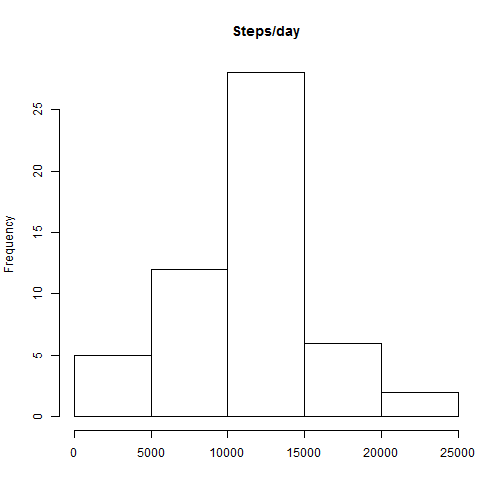
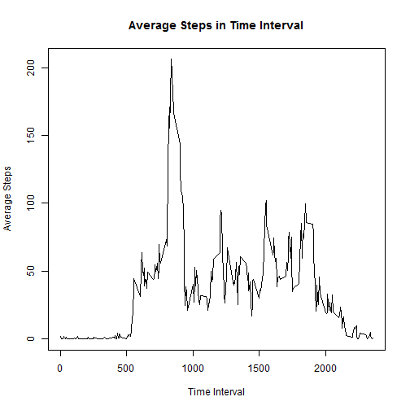

<<<<<<< HEAD
#Reproducible Research Assignment 1
##Author: Nicole Buechler
##Date: 03/08/2015

###Data

The data for this assignment can be downloaded from the course web site:

Dataset: Activity monitoring data [52K]
The variables included in this dataset are:

steps: Number of steps taking in a 5-minute interval (missing values are coded as NA)

date: The date on which the measurement was taken in YYYY-MM-DD format

interval: Identifier for the 5-minute interval in which measurement was taken

The dataset is stored in a comma-separated-value (CSV) file and there are a total of 17,568 observations in this dataset.

##Loading and preprocessing the data
###Show any code that is needed to  
Load the data (i.e. read.csv()):
originally I had all of the unzipping code in my markdown file, but markdown will not execute making the html properly so I had to removed it. the code looks like this:

```r
temp <- tempfile()
download.file("http://d396qusza40orc.cloudfront.net/repdata%2Fdata%2Factivity.zip",temp)
unzip(temp)
data <- read.csv("activity.csv")
unlink(temp)
```

Process/transform the data (if necessary) into a format suitable for your analysis:
first, we need to explore the format that the data variable is in. our graphs will not work without ensuring that the date is being read properly

```r
class(data$date)
```

```
## [1] "factor"
```
since date is a factor, we need to change it to time. but first it needs to be of the character class in order for strptime() to work. we will not manipulate data, we will make a supplemental frame for analysis

```r
dat <- data
dat$date <- as.character(dat$date)
dat$date <- strptime(dat$date, "%Y-%m-%d")
head(dat$date)
```

```
## [1] "2012-10-01 EDT" "2012-10-01 EDT" "2012-10-01 EDT" "2012-10-01 EDT"
## [5] "2012-10-01 EDT" "2012-10-01 EDT"
```
now the dates are in a good format. lets explore the other two variables.

```r
head(dat)
```

```
##   steps       date interval
## 1    NA 2012-10-01        0
## 2    NA 2012-10-01        5
## 3    NA 2012-10-01       10
## 4    NA 2012-10-01       15
## 5    NA 2012-10-01       20
## 6    NA 2012-10-01       25
```
looking at the first 6 lines, it looks like we have a lot of NAs going on in the steps column. lets explore the steps variable a little bit more just to see what the data in that column looks like.

```r
table(dat$steps)
```

```
## 
##     0     1     2     3     4     5     6     7     8     9    10    11 
## 11014     7     8     3    25    17    33    87    83    61    46    43 
##    12    13    14    15    16    17    18    19    20    21    22    23 
##    43    42    30    68    65    61    50    51    53    38    46    40 
##    24    25    26    27    28    29    30    31    32    33    34    35 
##    42    40    34    45    42    36    37    41    44    48    35    46 
##    36    37    38    39    40    41    42    43    44    45    46    47 
##    37    33    45    44    39    24    31    37    31    22    38    24 
##    48    49    50    51    52    53    54    55    56    57    58    59 
##    24    30    29    27    32    23    18    33    25    28    28    24 
##    60    61    62    63    64    65    66    67    68    69    70    71 
##    30    21    31    24    27    22    22    17    24    18    20    26 
##    72    73    74    75    76    77    78    79    80    81    82    83 
##    16    13    25    18    18    15    18    18    19    13    17    10 
##    84    85    86    87    88    89    90    91    92    93    94    95 
##    10    14    14     6    14     9    12     7    14     6    12    13 
##    96    97    98    99   100   101   102   103   104   105   106   107 
##     7    10     8     9     8    12     7    10     8     9     9     8 
##   108   109   110   111   112   113   114   115   116   117   118   119 
##     7     8     7    11    10     6    10     6     5    10     4    13 
##   120   121   122   123   124   125   126   127   128   129   130   131 
##     8     6     7     7     8     1     3     6    10     7     3     6 
##   132   133   134   135   136   137   138   139   140   141   142   143 
##     2     3     2    10     6     9     7     7     2     3     6    10 
##   144   145   146   147   148   149   150   151   152   153   154   155 
##     5     3     9     1     7     6     2     2     6     8     8     2 
##   156   157   158   159   160   161   162   163   164   165   166   167 
##     6     4     5     6     4     5     1     5     3     2     4     4 
##   168   170   171   172   173   174   175   176   177   178   179   180 
##     8     8     6     7     6     7     3     6     1     4     6     4 
##   181   182   183   184   185   186   187   188   189   190   191   192 
##     3     3     3     3     3     4     2     4     3     7     1     2 
##   193   194   195   196   197   198   199   200   201   202   203   204 
##     5     3     1     1     5     4     3     2     3     2     6     3 
##   205   206   207   208   209   210   211   212   213   214   216   219 
##     3     1     3     2     1     1     3     1     1     1     2     2 
##   221   223   224   225   229   230   231   232   235   236   237   238 
##     2     4     1     2     1     2     2     3     1     1     2     2 
##   240   241   242   243   244   245   247   248   249   250   251   252 
##     1     2     2     3     1     3     3     1     1     2     1     2 
##   253   254   255   256   257   258   259   260   261   262   263   264 
##     1     1     1     1     3     1     1     7     1     2     2     3 
##   265   266   267   269   270   271   272   274   275   276   277   279 
##     1     4     2     2     1     1     3     2     3     2     4     3 
##   280   281   282   283   284   285   286   287   289   290   291   292 
##     2     5     2     2     2     3     5     1     1     2     2     2 
##   293   294   295   297   298   299   301   302   303   304   305   306 
##     2     2     1     1     5     1     2     1     1     1     1     3 
##   307   308   309   310   311   312   313   314   315   316   317   318 
##     1     2     1     4     3     2     1     2     1     2     2     1 
##   319   320   321   322   323   324   325   326   327   328   330   331 
##     4     1     3     2     2     2     2     2     1     2     2     1 
##   332   333   334   335   336   339   340   341   343   344   345   346 
##     3     1     4     3     1     1     2     1     2     1     3     1 
##   347   349   350   351   353   354   355   356   357   358   359   360 
##     1     4     1     4     1     1     1     2     1     3     1     1 
##   361   362   363   364   365   366   368   370   371   372   373   374 
##     2     2     1     4     1     3     1     1     3     1     1     2 
##   375   376   377   378   380   384   385   387   388   389   391   392 
##     1     1     4     1     2     1     1     2     1     3     2     2 
##   393   394   395   396   397   399   400   401   402   403   404   405 
##     5     1     3     2     2     2     4     2     2     3     3     1 
##   406   408   410   411   412   413   414   415   416   417   418   419 
##     2     2     1     4     2     5     2     3     3     1     3     1 
##   421   422   423   424   425   426   427   428   429   431   432   433 
##     1     1     1     1     3     1     1     1     2     1     4     3 
##   434   435   436   437   439   440   441   442   443   444   446   449 
##     1     2     1     2     4     4     2     1     4     4     4     1 
##   450   451   453   454   456   457   458   459   461   462   463   464 
##     2     3     3     2     1     2     1     1     1     2     4     1 
##   465   466   467   468   469   470   471   472   473   474   475   476 
##     4     2     1     5     2     1     1     2     4     1     4     4 
##   477   478   479   480   481   482   483   484   485   486   487   488 
##     1     1     2     1     1     3     4     1     4     2     2     3 
##   489   490   491   492   493   494   495   496   497   498   499   500 
##     6     1     2     1     2     3     4     3     2     2     4     3 
##   501   503   504   505   506   507   508   509   510   511   512   513 
##     3     2     6     3     3     4     4     3     2     6     3     4 
##   514   515   516   517   518   519   520   521   522   523   524   526 
##     1     4     2     3     2     6     2     1     5     4     2     5 
##   527   528   529   530   531   532   533   534   535   536   537   539 
##     4     3     5     2     1     3     8     3     1     2     1     1 
##   540   541   542   544   545   546   547   548   549   551   553   555 
##     5     2     2     2     1     4     1     1     2     1     1     2 
##   556   559   562   567   568   569   571   573   574   577   581   584 
##     1     1     1     1     2     1     1     1     1     1     1     1 
##   591   592   594   597   600   602   606   608   611   612   613   614 
##     1     1     1     1     1     1     1     1     1     1     3     1 
##   618   619   625   628   630   634   635   637   638   639   643   652 
##     1     2     1     1     1     1     1     1     1     1     1     3 
##   655   659   662   665   667   668   679   680   681   682   686   687 
##     1     2     1     1     1     1     1     2     1     1     1     1 
##   690   693   697   698   701   706   708   709   710   713   714   715 
##     1     1     1     1     1     2     1     1     1     2     1     2 
##   717   718   720   721   725   726   727   729   730   731   732   733 
##     1     1     1     4     1     2     1     1     1     3     2     4 
##   734   735   736   737   738   739   741   742   743   744   745   746 
##     1     2     1     2     1     2     1     3     3     2     1     2 
##   747   748   749   750   751   752   753   754   755   756   757   758 
##     4     4     2     3     1     1     2     2     3     2     4     5 
##   759   760   765   766   767   768   769   770   777   781   783   785 
##     2     2     1     1     1     1     1     3     1     1     1     3 
##   786   789   794   802   806 
##     1     1     1     1     1
```
so we have 11014 0 values, and a varying frequency of other values. at this point in order to explore this column more, I might create buckets for steps to explore it a bit more with a historgram, but lets see what more is asked in the assingment first.

###What is mean total number of steps taken per day?
For this part of the assignment, you can ignore the missing values in the dataset.  
-Calculate the total number of steps taken per day 
we could use aggregate or ddply and summarise for this, I like ddply. we will use the original dataset for this section because we want date to be a factor, not as a regular date format. 

```r
library(plyr)
sumsteps <-  ddply(data, "date", summarise, steps_per_day = sum(steps))
head(sumsteps)
```

```
##         date steps_per_day
## 1 2012-10-01            NA
## 2 2012-10-02           126
## 3 2012-10-03         11352
## 4 2012-10-04         12116
## 5 2012-10-05         13294
## 6 2012-10-06         15420
```
-If you do not understand the difference between a histogram and a barplot, research the difference between them. Make a histogram of the total number of steps taken each day  

```r
hist(sumsteps$steps_per_day, main = "Steps/day", xlab = "")
```

 
-Calculate and report the mean and median of the total number of steps taken per day
we need to take out NAs in order to calculate these values, this happens with na.omit()

```r
steps_per_day <- na.omit(sumsteps$steps_per_day)
mean(steps_per_day)
```

```
## [1] 10766.19
```

```r
median(steps_per_day)
```

```
## [1] 10765
```

###What is the average daily activity pattern?
-Make a time series plot (i.e. type = "l") of the 5-minute interval (x-axis) and the average number of steps taken, averaged across all days (y-axis)  
lets, make a unique dataframe for this question, using summarise once again. we need to omit NAs in once again.


```r
library(plyr)
timeseries <- ddply(dat, "interval", summarise, averagesteps = mean(na.omit(steps)))
head(timeseries)
```

```
##   interval averagesteps
## 1        0    1.7169811
## 2        5    0.3396226
## 3       10    0.1320755
## 4       15    0.1509434
## 5       20    0.0754717
## 6       25    2.0943396
```

```r
plot(timeseries$interval, timeseries$averagesteps, type = "l", main="Average Steps in Time Interval", xlab = "Time Interval", ylab = "Average Steps")
```

 
-Which 5-minute interval, on average across all the days in the dataset, contains the maximum number of steps?  

```r
timeseries[max(timeseries$averagesteps), "interval"]
```

```
## [1] 1705
```

###Imputing missing values
Note that there are a number of days/intervals where there are missing values (coded as NA). The presence of missing days may introduce bias into some calculations or summaries of the data.  
-Calculate and report the total number of missing values in the dataset (i.e. the total number of rows with NAs)  

```r
NAframe <- data[!complete.cases(data),]
newframe <- na.omit(data)
nrow(data)-nrow(newframe)
```

```
## [1] 2304
```
-Devise a strategy for filling in all of the missing values in the dataset. The strategy does not need to be sophisticated. For example, you could use the mean/median for that day, or the mean for that 5-minute interval, etc.
I am going to use the mean for that 5-minute interval

```r
myfun <- function(x) {
  steps <- x[,"steps"] #separates out sort column
  rest_data <- x[,c(2,3)] #from rest of data
  steps[which(is.na(steps)==TRUE)] = mean(steps,na.rm = T) #replaces NA values with mean of steps column
  cbind(rest_data, steps)  #binds back together
}

replaceNA <- data
replaceNA$interval <- as.factor(replaceNA$interval)

library(plyr)
ddplyframe <- ddply(replaceNA, "interval", myfun) #evalutes my function on datasets that are split by interval
NAframe <- ddplyframe[ do.call(order, ddplyframe),]
head(NAframe)
```

```
##           date interval     steps
## 1   2012-10-01        0 1.7169811
## 62  2012-10-01        5 0.3396226
## 123 2012-10-01       10 0.1320755
## 184 2012-10-01       15 0.1509434
## 245 2012-10-01       20 0.0754717
## 306 2012-10-01       25 2.0943396
```

-Create a new dataset that is equal to the original dataset but with the missing data filled in.
see bullet above for the creation of ddplyframe
-Make a histogram of the total number of steps taken each day and Calculate and report the mean and median total number of steps taken per day. Do these values differ from the estimates from the first part of the assignment? What is the impact of imputing missing data on the estimates of the total daily number of steps?  
with NA values replaced, mean=median. mean stayed the same, but the mean differs from that of the original data set.


```r
sumframe_replacedNA <- ddply(ddplyframe, "date", summarise, sumsteps = sum(steps))
hist(sumframe_replacedNA$sumsteps, main = "Histogram of Total Steps Taken Per Day")
```

 

```r
mean(sumframe_replacedNA$sumsteps)
```

```
## [1] 10766.19
```

```r
median(sumframe_replacedNA$sumsteps)
```

```
## [1] 10766.19
```

###Are there differences in activity patterns between weekdays and weekends?
For this part the weekdays() function may be of some help here. Use the dataset with the filled-in missing values for this part.  
-Create a new factor variable in the dataset with two levels - "weekday" and "weekend" indicating whether a given date is a weekday or weekend day.  
we will use our NAframe

```r
NAframe$date <- as.character(dat$date)
NAframe$date <- strptime(dat$date, "%Y-%m-%d")

library(chron)
weekend <- is.weekend(NAframe$date)
weekend <- as.character(weekend)
weekend[weekend=="TRUE"] <- "weekend"
weekend[weekend=="FALSE"] <- "weekday"
weekend <- as.factor(weekend)
weekdayframe <- cbind(weekend, NAframe)
weekdayframe$date <- as.character(weekdayframe$date)
```
-Make a panel plot containing a time series plot (i.e. type = "l") of the 5-minute interval (x-axis) and the average number of steps taken, averaged across all weekday days or weekend days (y-axis). See the README file in the GitHub repository to see an example of what this plot should look like using simulated data.  

```r
library(plyr)
weeksplitsteps <- ddply(weekdayframe, .(weekend, interval), summarise, sumsteps = sum(steps))

library(colorspace)
library(ggplot2)
qplot(interval, sumsteps, data = weeksplitsteps, facets = .~weekend)
```

 
